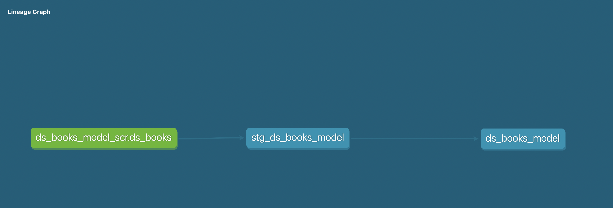
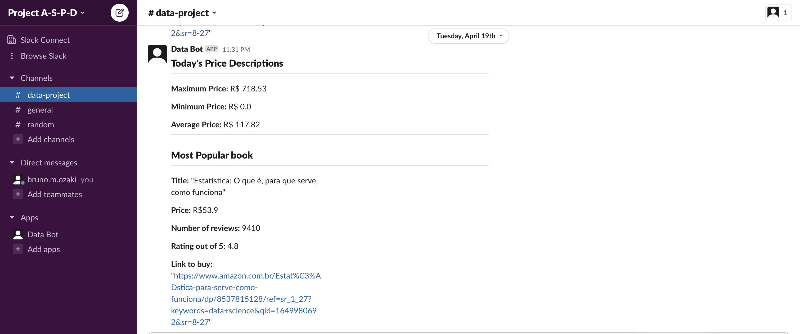
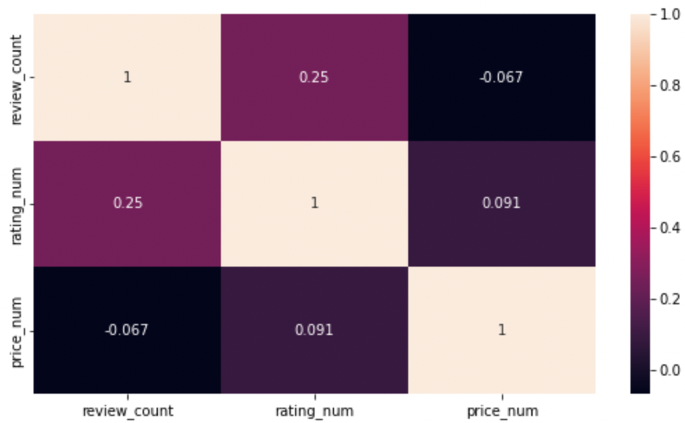
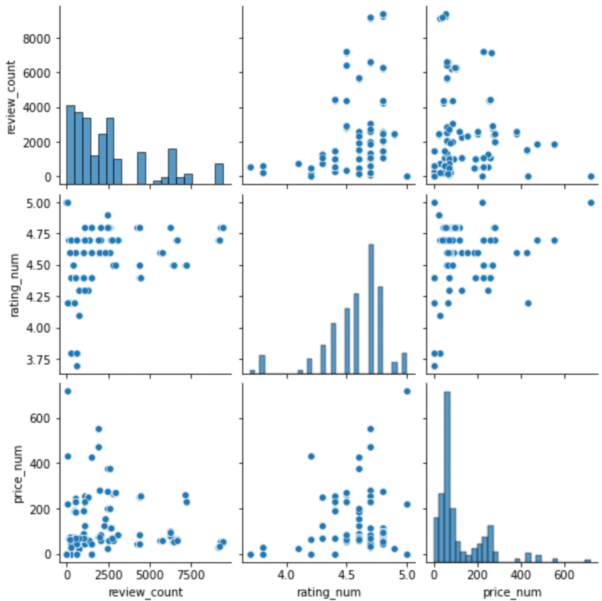

### About the Amazon DS Books Project
This project was based on the idea of me buying a few data science books. Ever since I got into this field of study, I have always 
thought that books are a great way of complementing our knowldge on a deeper level and it is a great reference guide. Also, having a bot send me messages for the most expensive, most popular books would be very helpful.

#### Steps:
1. Webscrape the amazon website for books related to data science;
2. Load the data into Postgres db; 
3. Transform the data using dbt;
4. Slack bot that sends message for price descriptions as well as the most popular book and its price, number of reviews and link to buy;
5. Small and quick analysis of the scraped data, trying to see if there are any correlation and insights.

#### Step 1
The script for the webscraper was purely based on the tutorial and code made available by Israel Dryer (also known as Izzy Analytics). The link to the youtube tutorial can be found on the following link:\
 https://www.youtube.com/watch?v=_AeudsbKYG8 \
 And the link to his GitHub repo can be found here:\
 https://github.com/israel-dryer/Amazon-Scraper \
Basically the script searches for a specific word on the Amazon website and scrapes the following data: 
- Title of the book
- Price
- Rating
- Number of reviews
- Url\
Then, after the scraping is done, it stores the data in a csv file.

#### Step 2
This step is pretty straight forward, but after the data is stored in a csv file, the script loads the data into the database (Postgres in this case). 

#### Step 3
For this transformation step, dbt is required. More information on how to install this powerful tool can be found on their website documentation. Link below: \
https://docs.getdbt.com/dbt-cli/install/overview \
Under the models folder, a ds_books_model folder is created. Here, we first set the source of the data in the schema.yml file. Then, we create a staging model and lastly a transformation model. Note that the staging model we barely touch the data. But in the ds_books_model, we do a few things, such as:
 - Create a column that classifies if a book is popular or not based on the number of reviews
 - Changes the data type for the price and rating to numeric
 - Filters out books that are not related to data. These books are ads\
 The lineage graph of the model looks like this. This graph was generated running the dbt command *dbt docs generate* and then *dbt docs serve* , which opens up a new url with the documentation of the model. \
 \
 
 

#### Step 4
The first thing when creating a slack bot is to head over to https://api.slack.com to create a new app. In this case, the bot is called Data bot(I know, pretty creative). Then, we have to set the right permissions to the bot. Our data bot has the permission to read and write messages on slack channels. After that, we have to give permission to the app to access the channel.\
The bot that was created sends a message of a summary of prices like maximum price, minimum price and the average price for data science books. It also sends a message of the title, the price, number of reviews, rating and url of the most popular book in this field.\
The message sent by the bot looks something like this\
\

I know, super creative name again for the slack workspace (A)mazon- (S)lack- (P)ostgres- (D)bt

#### Step 5
On this last step, we first extract the transformed data from the database. Then, we explore the data in a ipynb to see if there is any correlation between the variables review count, price and rating. Afterward, we check for the insights in those same varibles to see if there are any patterns. Lastly, we verify the most expensive book, the cheapest, the most popular and their atributes.\
\

\
\
\

